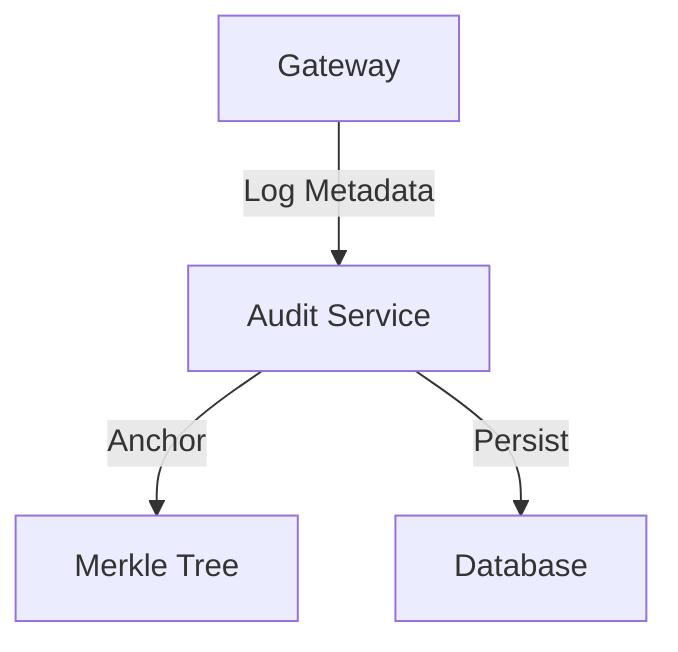

# Talos Audit Service

**Repo Role**: Immutable logging and compliance verification service for Talos messages.

## Abstract
The Audit Service provides a tamper-evident record of all message metadata routed through the managed gateway infrastructure. It anchors message hashes to a Merkle tree, enabling post-hoc verification of message existence and timing without revealing content.

## Introduction
Autonomous agents require accountability. The Audit Service ensures that even if an agent goes rogue, the record of its communications cannot be altered. This creates a "trust but verify" environment essential for finance and healthcare applications.

## System Architecture



## Technical Design
### Modules
- **logger**: Ingestion pipeline.
- **merkle**: Tree construction logic.
- **api**: Query interface.

### Data Formats
- **Log Entry**: `{ timestamp, sender_id, recipient_id, message_hash }`

## Evaluation
Evaluation: N/A for this repo.

## Usage
### Quickstart
```bash
docker compose up
```

## Operational Interface
*   `make test`: Run tests.
*   `scripts/test.sh`: CI entrypoint.

## Security Considerations
*   **Threat Model**: Insider modification of logs.
*   **Guarantees**:
    *   **Immutability**: Log entries form a hash chain.

## References
1.  [Talos Docs](../talos-docs/README.md)
