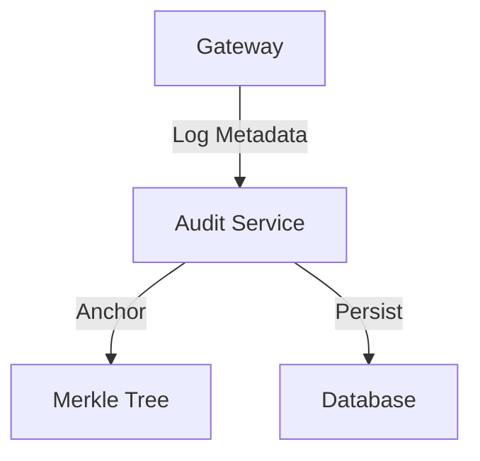

# Talos Audit Service


**Repo Role**: Immutable logging and compliance verification service for Talos messages.

## Abstract

The Audit Service provides a tamper-evident record of all message metadata routed through the managed gateway infrastructure. It anchors message hashes to a Merkle tree, enabling post-hoc verification of message existence and timing without revealing content.

## Introduction

Autonomous agents require accountability. The Audit Service ensures that even if an agent goes rogue, the record of its communications cannot be altered. This creates a "trust but verify" environment essential for finance and healthcare applications.

## System Architecture



## Technical Design

### Modules

- **logger**: Ingestion pipeline.
- **merkle**: Tree construction logic.
- **api**: Query interface.

### Data Formats

- **Log Entry**: `{ timestamp, sender_id, recipient_id, message_hash }`

## Evaluation

Evaluation: N/A for this repo.

## Usage

### Local Development

Prerequisites: Python 3.10, 3.11, or 3.12. (Note: `talos-sdk-py` is required and installed via `requirements.txt`).

```bash
# Setup virtual environment
python -m venv .venv
source .venv/bin/activate

# Install dependencies (including editable package)
pip install --upgrade pip
pip install -r requirements.txt
pip install -r requirements-dev.txt
pip install -e .

# Run the app
uvicorn src.main:app --reload --host 127.0.0.1 --port 8000

# Run tests & linting
pytest
ruff check .
ruff format .
```

### With Docker

```bash
docker build -t talos-audit-service .
docker run -p 8000:8000 talos-audit-service
```

## Operational Interface

- `make test`: Run tests.
- `scripts/test.sh`: CI entrypoint.

## Security Considerations

- **Threat Model**: Insider modification of logs.
- **Guarantees**:
  - **Immutability**: Log entries form a hash chain.

## References

1.  [Talos Wiki](https://github.com/talosprotocol/talos/wiki)
2.  [Audit Explorer](https://github.com/talosprotocol/talos/wiki/Audit-Explorer)
