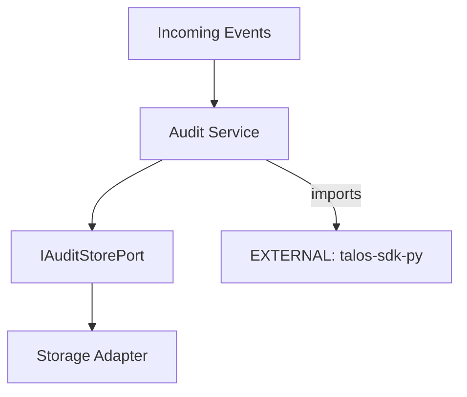

# talos-audit-service Architecture

## Overview
`talos-audit-service` is the dedicated audit log aggregator and query engine for the Talos Protocol.

## Internal Components

| Component | Purpose |
|-----------|---------|
| `main.py` | Service entry point |
| `bootstrap.py` | DI container setup |
| `audit.py` | Audit aggregation logic |

## External Dependencies

| Dependency | Type | Usage |
|------------|------|-------|
| `[EXTERNAL]` talos-sdk-py | PyPI | Ports, Adapters, DI container |
| `[EXTERNAL]` talos-contracts | PyPI | Event schemas, cursor helpers |

## Boundary Rules
- ✅ Use SDK ports for storage abstraction
- ✅ Import schemas from contracts
- ❌ No direct database access outside adapters

## Data Flow

